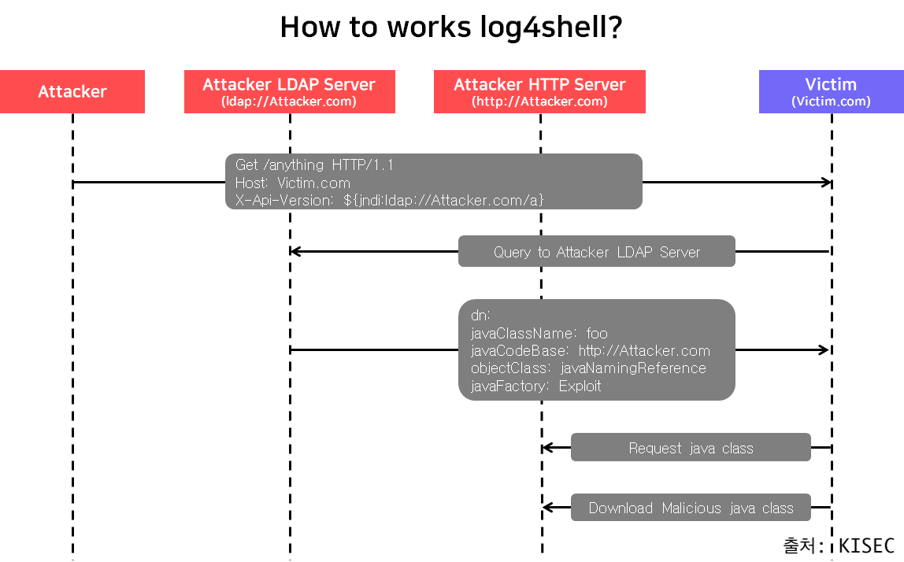
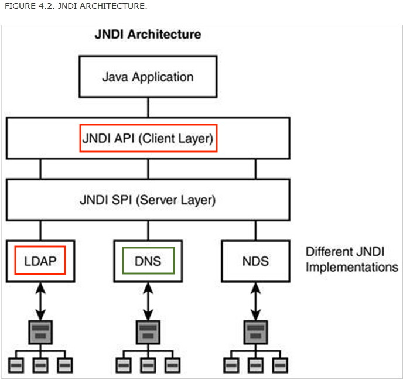

# log4shell 취약점
### CVE-2021-44228
<br />
<br />

## 키퍼 8기 정현모
---
# 발표 주제 선정
- ~~2학년 때 카카오 블라인드 면접간 썰~~
- ~~Spring Security~~
- ~~키퍼 홈페이지 리뉴얼~~
- **log4j shell 취약점**
- ~~SI 업체에서 6개월간 현장실습 후기~~
- ~~Spring4Shell 취약점~~
---
# 이 발표를 듣는 사람
- 프로토콜, DNS 서버, 기본적인 웹 통신에 대해 아는 사람
- Java 언어에 대해 어느정도 이해하고 있는 사람
- log4shell 취약점에 대해 궁금한 사람
---
# log4j란
### 개발자가 로그문의 출력을 다양한 대상으로 할 수 있도록 도와주는 오픈소스
---
# 로그문의 출력?
```C
int main() {
  printf("사용자 %s이(가) 들어왔습니다.", user.name);
}
```
```Java
public static void main(String[] args) {
  System.out.println("사용자 {}이(가) 들어왔습니다.", user.name)
}
```
```python
def __main__():
  print(f"사용자 {user.name}이(가) 들어왔습니다.")
```
---
# 위의 표준 출력 대신 log4j를 쓰는 이유
- log4j가 로깅을 하는 대상은 파일 뿐만 아니라 표준 출력, Output Stream, 원격지의 로그 지정 등 유연하게 사용 가능
- 속도에 최적화 되어 있음
- 멀티 스레드 환경에서도 안정적인 로그 기록
- 로그의 레벨을 표준화 함으로써 안정적인 개발 가능
> 물론 로깅 오픈소스로 `log4j` 외에 `logback`, `slf4j` 같은 것들도 있습니다.

---
# 아래와 같은 로그를 남기는 작업이 있다고 가정
<br />

```Java
public String index(@RequestHeader("X-Api-Version") String apiVersion) {
  logger.info("Received a request for API version " + apiVersion);
  return "Hello, world!";
}
```
---


---
# LDAP?
Lightweight Directory Access Protocol
- 디렉토리 안에서 검색을 빠르게 할 수 있는 표준 프로토콜
# JNDI?
Java Naming and Directory Interface
- 이름이나 디렉토리를 조회하고 관리하는 인터페이스

---
# LDAP 이해
## JNDI에서 LDAP 사용하기
디렉토리 서비스의 URL(Uniform Resource Locator)입니다. URL의 형식은 다음 중 하나일 수 있습니다.
- LDAP 서버를 기반으로 하는 디렉토리 서비스의 경우 `ldap://hostname/contextName`
- 로컬 파일 시스템을 기반으로 하는 디렉토리 서비스의 경우 `file://directoryPath`

---
# 아래와 같은 로그를 남기는 작업이 있다고 가정
<br />

```Java
public String index(@RequestHeader("X-Api-Version") String apiVersion) {
  logger.info("Received a request for API version " + apiVersion);
  return "Hello, world!";
}
```
---


---
# 키퍼 홈페이지
- 홈페이지 개발 시작 전에 log4j 버전 업데이트를 통해 해당 취약점은 없음
## 생각보다 위험하지 않을 수도
- 아웃바운드로 LDAP에 요청을 보내는 389 포트가 열려있어야 함 
---

# 감사합니다